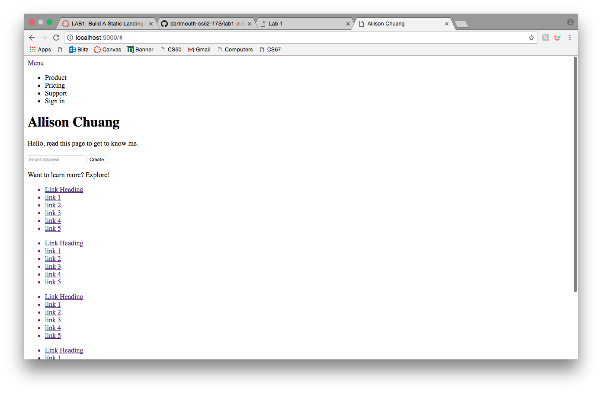
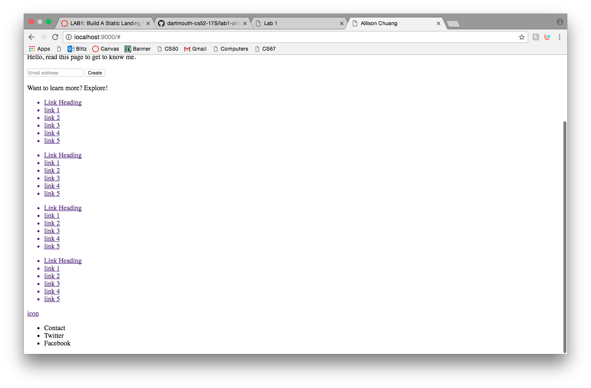

# What I Did/Extra Features
I was able to create a webpage that very similarly followed the screenshots given in the lab assignment using flex boxes. The page also takes into account screen resizing and has hover effects on buttons. In addition, I was able to create a gradient from the image to the background color and create a drop-down menu using the checkbox hack.

# What Worked
The flex boxes and hover effects came were very helpful in creating a clean page. It was also really helpful to have the font-awesome icons. The layout worked out nicely.

# What Didn't Work
My drop-down menu/checkbox hack was created kind of inefficiently. I had to create a separate div for the menu and the call "display: none" to hide divs that I didn't want.

# Layout stage screenshots

